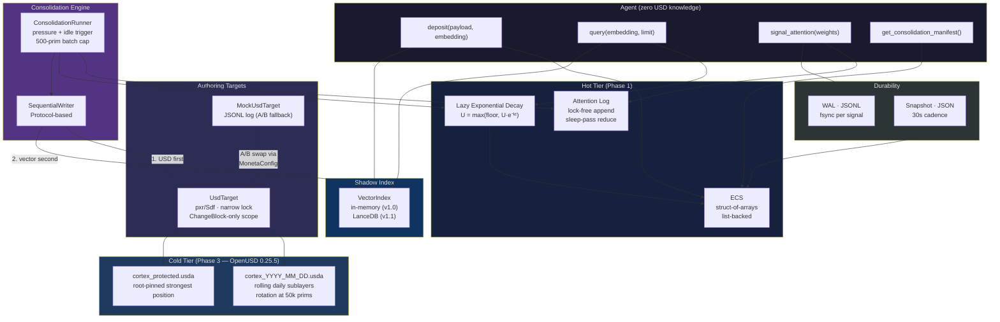
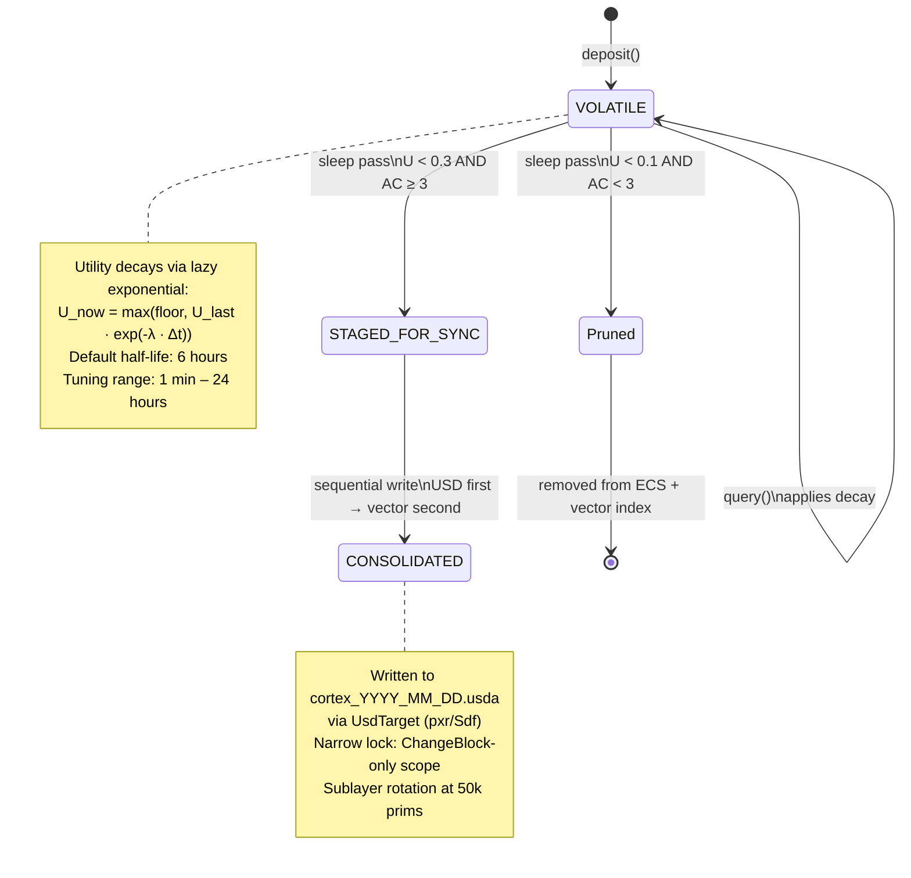
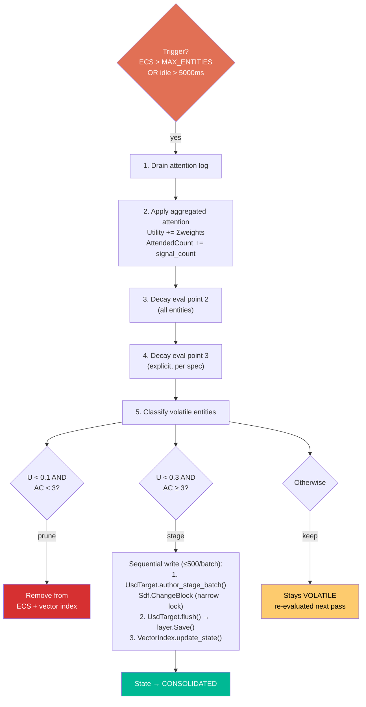
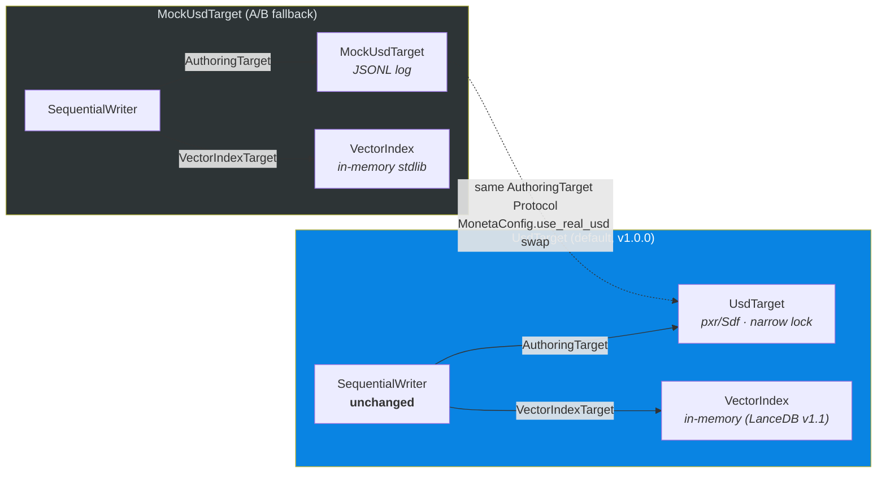
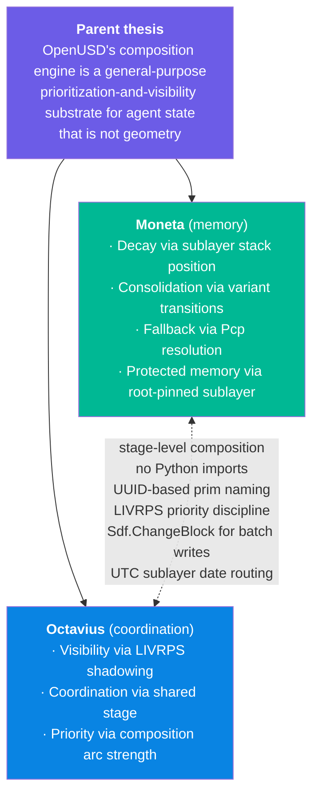

# Moneta

**Memory substrate for LLM agents built on OpenUSD's composition engine.**

Moneta implements working and consolidated memory for agents using a hot ECS tier for active state and OpenUSD's composition engine as the cold cognitive substrate. The name invokes Juno Moneta — Roman goddess of warning and memory, whose temple housed the mint because she also *reminded*. Memory as advisory, not just storage.

Sibling project: [Octavius](https://github.com/JosephOIbrahim) (coordination substrate on the same USD thesis). Moneta is memory; Octavius is coordination. They share [substrate conventions](docs/substrate-conventions.md) but not Python code — the stage is the interface.

---

## Status

| Phase | Status | Gate |
|-------|--------|------|
| **Phase 1** — ECS + four-op API | **Shipped** (v0.1.0) | 94 tests green, 30-min synthetic session clean |
| **Phase 2** — USD benchmark | **Closed** (v0.2.0) | 243-config sweep, Yellow tier verdict |
| **Phase 3** — USD integration | **Shipped** (v1.0.0) | Real USD writer, narrow lock, 775M-assertion safety verification |

**Current tag:** `v1.0.0`

---

## Architecture

### System overview



### Memory lifecycle



### Consolidation sleep-pass flow



### Protocol injection — dual-target architecture



### Substrate family



---

## Installation

### What you need first

- **Python 3.11 or newer.** If you type `python --version` in your terminal and see 3.11+, you're good. If not, grab it from [python.org](https://www.python.org/downloads/).
- **git.** You used it to get here. You have it.
- That's it. Moneta has **zero runtime dependencies** in Phase 1 — no numpy, no torch, no database drivers. Just Python's standard library.

### Step by step

**1. Get the code**

```bash
git clone https://github.com/JosephOIbrahim/Moneta.git
cd Moneta
```

**2. Install Moneta in dev mode**

This makes `import moneta` work from anywhere and pulls in test tools (pytest, ruff):

```bash
pip install -e .[dev]
```

> **What does `-e .` mean?** It installs the project in "editable" mode — Python points at your local copy instead of making a separate installation. Changes you make to the code take effect immediately, no reinstall needed.

**3. Verify it works**

Run the smoke check (takes < 1 second):

```bash
python -c "import moneta; moneta.smoke_check(); print('OK')"
```

If you see `OK`, Moneta is installed and the four-op API, decay math, attention log, consolidation engine, and sequential writer are all wired correctly.

**4. Run the tests (optional but satisfying)**

```bash
pytest
```

You should see **94 passed** (and 2 skipped if you don't have OpenUSD/pxr installed). These cover the decay math, ECS operations, attention reducer, four-op API contract, durability round-trips, sequential-writer ordering, and a 30-minute synthetic agent session (compressed to ~0.3 seconds via virtual clock). The 2 skipped modules are Phase 3 USD tests that require a pxr-capable interpreter.

### If something goes wrong

| Symptom | Fix |
|---------|-----|
| `python: command not found` | Try `python3` instead, or install Python from [python.org](https://www.python.org/downloads/) |
| `pip install` says "No module named pip" | Run `python -m ensurepip --upgrade` first |
| `ModuleNotFoundError: No module named 'moneta'` | You forgot step 2. Run `pip install -e .[dev]` from the Moneta directory |
| `pytest` says "command not found" | Run `python -m pytest` instead, or make sure step 2 completed without errors |
| Tests fail with import errors | Make sure you're using Python 3.11+. Moneta uses `from __future__ import annotations` and modern type syntax |

### For contributors

```bash
# Lint check
ruff check src tests

# Auto-format
ruff format src tests

# Run just the unit tests (fast, < 0.3s)
pytest tests/unit

# Run integration tests (durability, sequential writer ordering)
pytest tests/integration

# Run the synthetic session completion gate
pytest tests/load
```

---

### Minimal usage

```python
import moneta

moneta.init()

# Deposit a memory
eid = moneta.deposit(
    payload="The user prefers concise explanations.",
    embedding=[0.12, -0.45, 0.78, ...],  # from your embedder
)

# Query by semantic similarity (utility-weighted)
results = moneta.query(embedding=[0.12, -0.45, 0.78, ...], limit=5)
for m in results:
    print(m.payload, f"utility={m.utility:.2f}", f"attended={m.attended_count}")

# Signal attention (async — applied at next sleep pass)
moneta.signal_attention({eid: 0.3})

# Run a consolidation sleep pass (harness-level, not agent-facing)
result = moneta.run_sleep_pass()
print(f"pruned={result.pruned} staged={result.staged}")
```

---

## The four-op API

The entire agent-facing surface. Agents have zero knowledge of ECS, USD, vector indices, decay, or consolidation.

| Operation | Signature | Returns |
|-----------|-----------|---------|
| `deposit` | `(payload: str, embedding: List[float], protected_floor: float = 0.0)` | `UUID` |
| `query` | `(embedding: List[float], limit: int = 5)` | `List[Memory]` |
| `signal_attention` | `(weights: Dict[UUID, float])` | `None` |
| `get_consolidation_manifest` | `()` | `List[Memory]` |

Signatures are locked per [ARCHITECTURE.md §2](ARCHITECTURE.md). No fifth operation may be added without [§9 escalation](MONETA.md).

Full API reference with usage examples: [docs/api.md](docs/api.md)

---

## Decay model

Lazy memoryless exponential, evaluated at access time only — never on a background tick.

```
U_now = max(ProtectedFloor, U_last · exp(-λ · (t_now - t_last)))
```

| Time since deposit | Utility (no reinforcement, 6h half-life) |
|--------------------|------------------------------------------|
| 0 min | 1.000 |
| 30 min | 0.944 |
| 1 hour | 0.891 |
| 3 hours | 0.707 |
| 6 hours | 0.500 |
| 12 hours | 0.250 |
| 24 hours | 0.063 |

`signal_attention()` boosts utility and increments attended count. Memories that are actively reinforced survive; unreinforced memories decay toward pruning.

Tuning guide: [docs/decay-tuning.md](docs/decay-tuning.md)

---

## Project structure

```
src/moneta/
├── api.py                 # four-op API + init/smoke_check + dual-target routing
├── types.py               # Memory, EntityState
├── ecs.py                 # flat struct-of-arrays hot tier
├── decay.py               # lazy exponential decay
├── attention_log.py       # lock-free append + sleep-pass reducer
├── vector_index.py        # shadow vector index (in-memory; LanceDB v1.1)
├── durability.py          # WAL-lite snapshot + JSONL WAL
├── sequential_writer.py   # USD-first, vector-second Protocol
├── consolidation.py       # sleep-pass trigger + selection + 500-prim batch cap
├── usd_target.py          # Phase 3 real USD writer (narrow lock, OpenUSD 0.25.5)
├── mock_usd_target.py     # Phase 1 JSONL authoring target (A/B fallback)
├── manifest.py            # get_consolidation_manifest delegate
└── __init__.py            # re-exports

tests/
├── unit/                  # 87 tests — Phase 1 (70) + Phase 3 USD (17)
├── integration/           # 28 tests — Phase 1 (22) + Phase 3 USD (6)
└── load/                  # 2 tests — 30-min synthetic session gate

scripts/
└── usd_metabolism_bench_v2.py   # Phase 2 benchmark + Pass 5 stress test harness

docs/
├── api.md                       # four-op reference
├── decay-tuning.md              # λ tuning guide
├── substrate-conventions.md     # 6 conventions shared with Octavius
├── agent-commandments.md        # MoE agent discipline (8 commandments)
├── phase2-benchmark-results.md  # Phase 2 analyst interpretation (243 configs)
├── phase2-closure.md            # Phase 2 rulings + operational envelope
├── phase3-closure.md            # Phase 3 closure record
├── pass5-q6-findings.md         # Q6 thread-safety ruling
├── patent-evidence/             # dated evidence entries for counsel
└── rounds/                      # Gemini Deep Think scoping outputs
```

---

## Locked decisions

These cannot be re-opened without [§9 escalation](MONETA.md):

1. **Four-op API** — `deposit`, `query`, `signal_attention`, `get_consolidation_manifest`. No fifth op.
2. **Decay math** — `U = max(floor, U·exp(-λ·Δt))`. Three evaluation points, no fourth.
3. **Concurrency primitive** — append-only attention log, reduced at sleep pass. No locks.
4. **Atomicity** — sequential write (USD first, vector second). No 2PC. Orphans benign.

---

## Phase 2 verdict

**YELLOW — clean in the operational envelope, with documented graceful degradation beyond it.**

The USD benchmark measured lock-and-rebuild tax across 243 configs in 52.9 minutes on a Threadripper PRO 7965WX with OpenUSD 0.25.5. Key finding: the bottleneck is `Save()` serialization against accumulated sublayer content, not Pcp rebuild (which is effectively free at 0.1–2.6ms).

| Accumulated prims | Shadow commit | p95 stall (median) | Verdict |
|-------------------|--------------|-------------------|---------|
| 0 | 5ms | 8ms | Green |
| 0 | 50ms | 56ms | Yellow |
| 25,000 | 15ms | 78ms | Yellow |
| 100,000 | 15ms | 213ms | Yellow |
| 100,000 | 50ms | 251ms | Yellow (max 370ms) |

Phase 3 operational envelope: sublayer rotation at 50k prims, idle-window consolidation, batch cap 500, shadow commit budget ≤15ms. Within this envelope, steady-state p95 stall sits in the 50–170ms band.

Full results: [docs/phase2-benchmark-results.md](docs/phase2-benchmark-results.md) | Rulings: [docs/phase2-closure.md](docs/phase2-closure.md)

---

## Phase 3 verdict

**GREEN-ADJACENT — narrow writer lock, ChangeBlock-only scope.**

Phase 3 shipped real USD integration against OpenUSD 0.25.5. The Q6 concurrent Traverse + Save investigation (Pass 5) ruled DETERMINISTIC SAFE: 10,000 iterations, 775M prim-level concurrent read assertions, zero failures. The writer lock was shrunk from full-width (ChangeBlock + Save) to ChangeBlock-only scope (Pass 6).

| Batch size | Wide-lock p95 stall | Narrow-lock p95 stall | Reduction |
|------------|--------------------|-----------------------|-----------|
| 10 (typical) | 127–176ms | 0.6–0.8ms | **99.5%** |
| 100 | ~130ms | ~13ms | ~90% |
| 1000 | 152–217ms | 148–257ms | ~0% (ChangeBlock dominates) |

At Moneta's operational point (batch ≤ 500, accumulated ≤ 50k prims), the reader stall drops from the Phase 2 Yellow steady-state (~131ms) to a projected 10–30ms.

Full closure: [docs/phase3-closure.md](docs/phase3-closure.md) | Patent evidence: [docs/patent-evidence/](docs/patent-evidence/)

---

## Novelty claims

Moneta is not novel as a tiered memory architecture. It is novel as a **substrate choice**:

1. **OpenUSD composition arcs as cognitive state substrate** — LIVRPS resolution order implicitly encodes decay priority
2. **USD variant selection as fidelity LOD primitive** — detail-to-gist transitions via `VariantSelection`
3. **Pcp-based resolution as implicit multi-fidelity fallback** — highest surviving fidelity served without routing logic
4. **Protected memory as root-pinned strong-position sublayer** — non-decaying state falls out of composition, not runtime checks

These four claims are **structural, not temporal** — they hold across Green, Yellow, and Red integration tiers. Empirically evidenced in [docs/patent-evidence/](docs/patent-evidence/). Patent filing is the next post-v1.0.0 action.

---

## Lineage

Round 1 (scoping brief) → Round 2 (Gemini Deep Think architectural spec) → Round 2.5 (Claude prior-art review) → Round 3 (Gemini Deep Think validation — structural-not-temporal insight) → **Phase 1** (5 passes, 94 tests, v0.1.0) → **Phase 2** (benchmark, interpretation, v0.2.0) → **Phase 3** (7 passes, narrow lock, 775M-assertion safety verification, v1.0.0)

---

## Related docs

| Document | Purpose |
|----------|---------|
| [MONETA.md](MONETA.md) | Build blueprint — phasing, risks, roles, escalation |
| [ARCHITECTURE.md](ARCHITECTURE.md) | Locked spec — source of truth for implementation |
| [docs/api.md](docs/api.md) | Four-op API reference with examples |
| [docs/decay-tuning.md](docs/decay-tuning.md) | λ tuning guide with curves |
| [docs/substrate-conventions.md](docs/substrate-conventions.md) | 6 conventions shared with Octavius |
| [docs/phase2-closure.md](docs/phase2-closure.md) | Phase 2 verdict + operational envelope |
| [docs/phase3-closure.md](docs/phase3-closure.md) | Phase 3 closure + pass-by-pass record |
| [docs/patent-evidence/](docs/patent-evidence/) | Dated evidence for patent counsel |

---

## License

Proprietary. 3 patents pending (USD cognitive state, digital injection, Cosmos predictive lighting).

---

*Built from the inside out. Substrate-first. Ship Moneta.*
