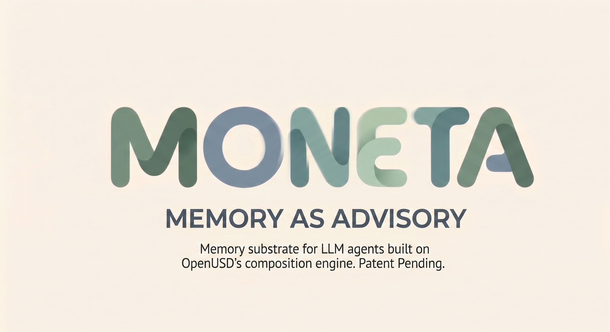
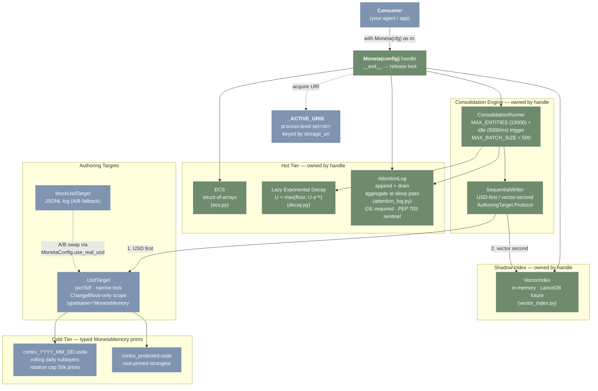
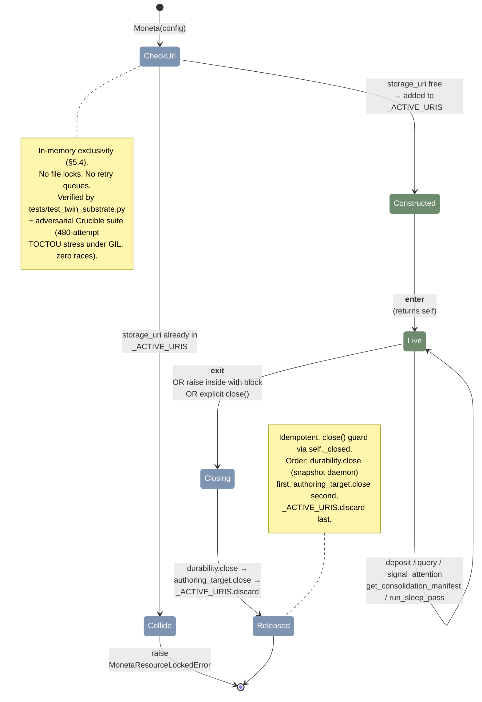
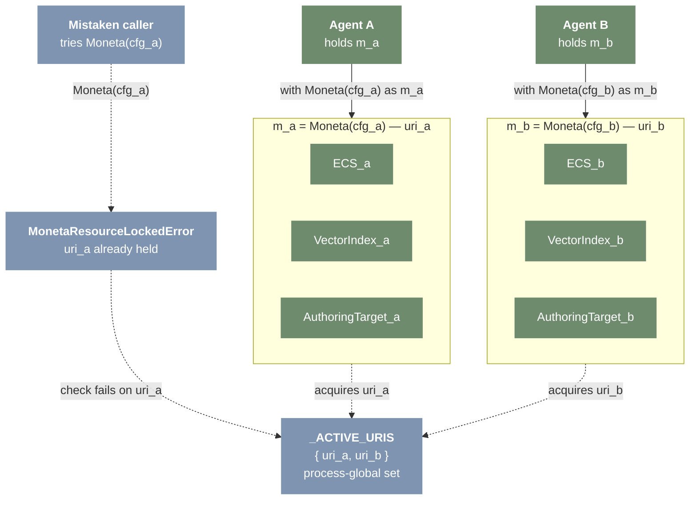
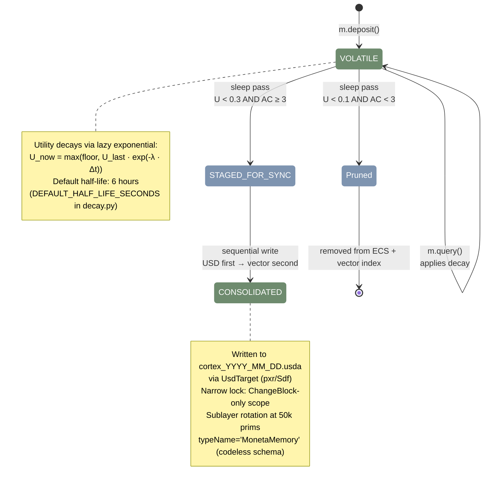
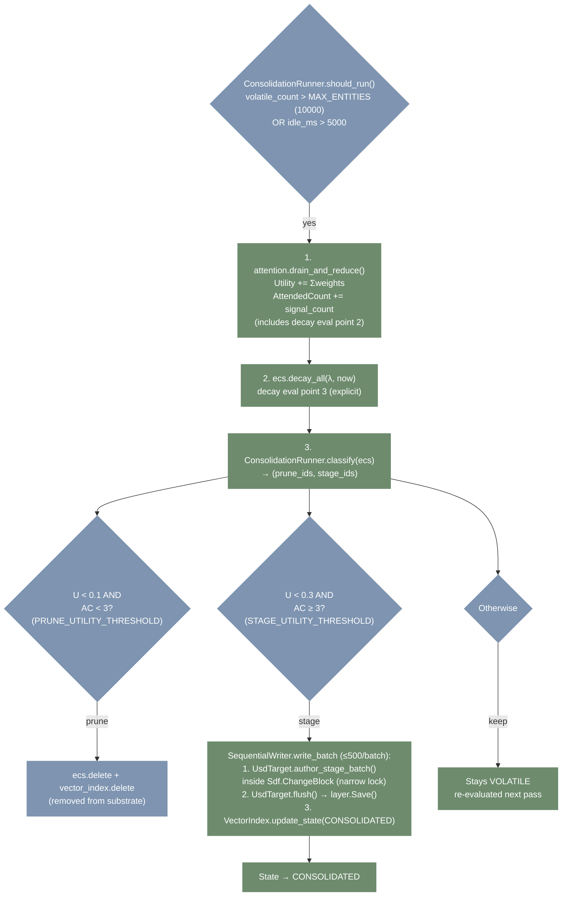
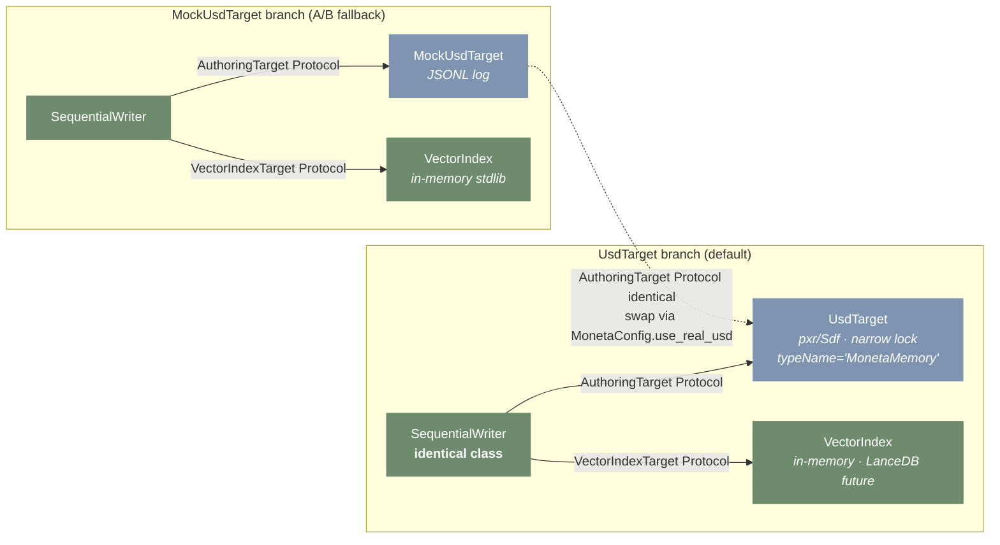
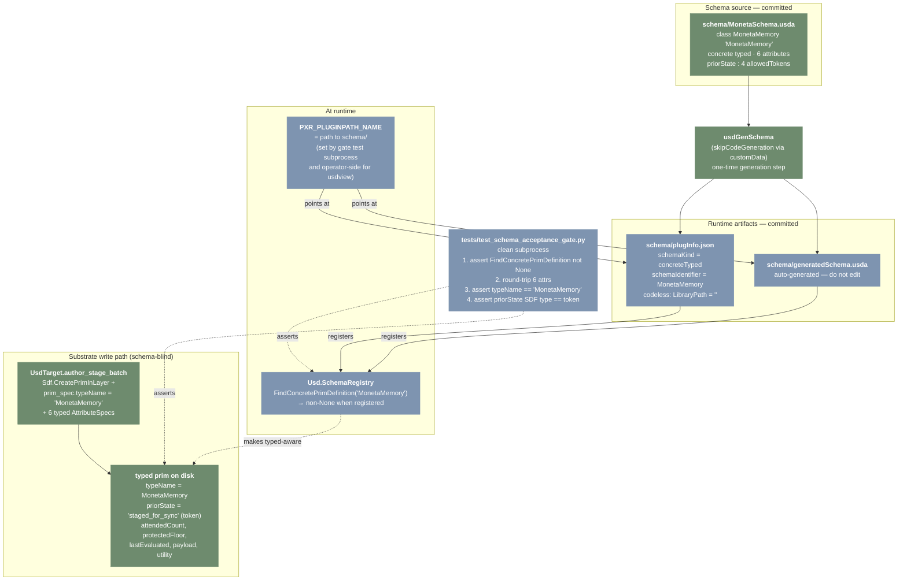
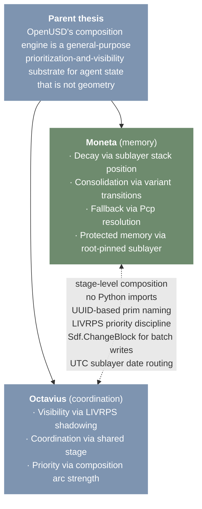
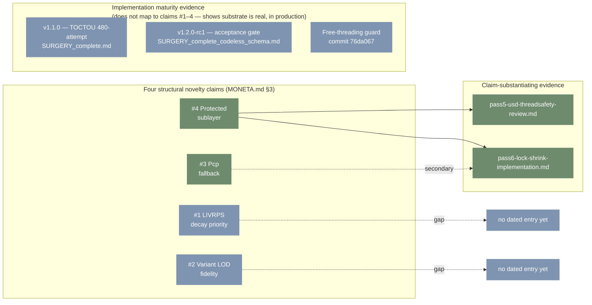

<p align="center">
  
</p>

# Moneta

**Long-term memory for LLM agents — forgets the noise, keeps what matters.** Built on OpenUSD's composition engine.

---

## TL;DR

**You're building an LLM agent.** It needs memory that:

- **Lasts past turn 30.** Facts learned in turn 3 are still there.
- **Forgets the noise.** Old, unused memories fade; reinforced ones stick.
- **Doesn't drown the prompt.** Retrieval ranks by *relevance × utility*, not raw similarity.
- **Splits hot from cold.** Working memory in RAM. Durable storage on disk.

**Moneta is a Python library.** You hold a handle, you call four operations:

```python
import moneta

with moneta.Moneta(moneta.MonetaConfig.ephemeral()) as m:
    eid = m.deposit("the user prefers concise answers", embedding=[...])
    results = m.query(embedding=[...], limit=5)
    m.signal_attention({eid: 0.3})       # this memory was useful
    m.run_sleep_pass()                   # consolidate survivors
```

**No background threads. No daemons. No LLM calls inside.** Four operations, full stop.

> The name invokes **Juno Moneta** — Roman goddess of warning and memory, whose temple housed the Roman mint because she also *reminded*. Memory as advisory, not just storage.

---

## Status

| Phase | Tag | What landed |
|---|---|---|
| **Phase 1** — ECS + four-op API | `v0.1.0` | 94 tests green, 30-min synthetic session clean |
| **Phase 2** — USD benchmark | `v0.2.0` | 243-config sweep, Yellow tier verdict |
| **Phase 3** — Real USD integration | `v1.0.0` | Real USD writer, narrow lock, 775M-assertion safety verification |
| **Singleton surgery** — handle API | `v1.1.0` | Module-level singleton replaced by `Moneta(config)` handle. Multi-instance per process. |
| **Codeless schema migration** — typed `MonetaMemory` prims | **`v1.2.0-rc1`** | USD codeless schema; on-disk prims gain `typeName="MonetaMemory"`, USD camelCase attrs, `priorState` as token. Schema-aware in usdview. |
| **Free-threading guard** — `AttentionLog` PEP 703 sentinel | (commit `76da067`) | `AttentionLog.__init__` raises `RuntimeError` under `sys._is_gil_enabled() is False`. Lock-free swap-and-drain correctness depends on the GIL; guard converts silent failure into a loud one. |

**Current version:** `v1.2.0-rc1`. **Test count:** 109 plain Python passing + 7 properly-gated pxr cases under plain Python (skipped); **149 passing total under hython** (OpenUSD 0.25.5).

Sibling project: [Octavius](https://github.com/JosephOIbrahim) (coordination substrate on the same USD thesis). Moneta is memory; Octavius is coordination. They share [substrate conventions](docs/substrate-conventions.md) but not Python code — the stage is the interface.

---

## Quick start — about 60 seconds, three steps

You'll have it cloned, smoke-tested, and (optionally) green on the test suite by the end of this section.

### 1. Install

```bash
git clone https://github.com/JosephOIbrahim/Moneta.git
cd Moneta
pip install -e .[dev]
```

Python ≥ 3.11. **Zero runtime dependencies** for the hot tier — no numpy, no torch, no DB drivers. Stdlib only. The Phase 3 USD writer needs `pxr` from a bundled OpenUSD distribution, but you can ignore that until you want to write to disk.

### 2. Smoke check

```bash
python -c "import moneta; moneta.smoke_check(); print('OK')"
```

**You're good when you see `OK`.** That means the four ops, decay math, attention reducer, sleep pass, and consolidation are all wired.

### 3. Run the tests (optional)

```bash
pytest
```

**You should see 109 passed, 7 skipped.** The skipped ones are pxr-gated USD tests — they run under hython if you have OpenUSD 0.25.5 installed (149 total under hython).

### Stuck?

| Symptom | Fix |
|---|---|
| `python: command not found` | Try `python3`, or install Python from [python.org](https://www.python.org/downloads/) |
| `No module named 'moneta'` | Run `pip install -e .[dev]` from the Moneta directory |
| `pytest: command not found` | Run `python -m pytest` |
| `TypeError: Moneta() missing 1 required ... 'config'` | That's by design (§5.3 of the design brief — no implicit defaults). Pass `MonetaConfig.ephemeral()` for tests. |

---

## The four-op API

The entire agent-facing surface. Agents have **zero knowledge** of ECS, USD, vector indices, decay, or consolidation.

| Operation | Signature | Returns |
|---|---|---|
| `deposit` | `(payload: str, embedding: List[float], protected_floor: float = 0.0)` | `UUID` |
| `query` | `(embedding: List[float], limit: int = 5)` | `List[Memory]` |
| `signal_attention` | `(weights: Dict[UUID, float])` | `None` |
| `get_consolidation_manifest` | `()` | `List[Memory]` |

These are methods on the `Moneta` handle. Plus one harness-level operator:

| Operation | Signature | What it does |
|---|---|---|
| `run_sleep_pass` | `()` | Drains attention log, applies decay, prunes/stages survivors |

### Hello world

```python
import moneta

# Construct a handle. Each handle owns one storage_uri; two handles
# on the same URI raise MonetaResourceLockedError.
with moneta.Moneta(moneta.MonetaConfig.ephemeral()) as m:
    eid = m.deposit(
        payload="The user prefers concise explanations.",
        embedding=[0.12, -0.45, 0.78, ...],   # from your embedder
    )

    # Retrieve by semantic similarity (utility-weighted)
    results = m.query(embedding=[0.12, -0.45, 0.78, ...], limit=5)
    for memory in results:
        print(memory.payload, f"u={memory.utility:.2f}", f"a={memory.attended_count}")

    # Tell Moneta this memory was useful (async — applied at next sleep pass)
    m.signal_attention({eid: 0.3})

    # Periodic consolidation (drain attention log, decay, prune/stage)
    result = m.run_sleep_pass()
    print(f"pruned={result.pruned} staged={result.staged}")
```

### Why a handle?

Before `v1.1.0` Moneta exposed module-level functions backed by a singleton — one substrate per process. The handle (`v1.1.0`) lifts that limit:

- **Multiple instances per process.** Run two agents side-by-side, or one substrate per tenant in a hosted setup.
- **Explicit lifecycle.** `with Moneta(config) as m:` is the canonical form. `__exit__` releases all resources and the in-process URI lock.
- **No-arg trap.** `Moneta()` raises `TypeError` by design — every consumer declares its storage boundary on line one. Use `MonetaConfig.ephemeral()` for tests.
- **Two handles on the same `storage_uri` raise.** In-memory `_ACTIVE_URIS` registry. No silent sharing.

Full design rationale: [`DEEP_THINK_BRIEF_substrate_handle.md`](DEEP_THINK_BRIEF_substrate_handle.md). Surgery record: [`SURGERY_complete.md`](SURGERY_complete.md).

Full API reference with usage examples: [`docs/api.md`](docs/api.md).

---

## How it works (architecture)

### System overview



### Handle lifecycle (`v1.1.0`)



### Multi-instance support (`v1.1.0`)

The marquee `v1.1.0` capability — **N substrates per Python process**. Each handle owns its `storage_uri`; the in-memory `_ACTIVE_URIS` registry refuses any second handle that tries to claim a URI that's already taken.



Substrates are **physically distinct objects** under the hood — `m_a.ecs is not m_b.ecs`, same for `attention`, `vector_index`, `authoring_target`. A deposit on `m_a` is invisible to `m_b`. A protected-quota slot used in `m_a` does not consume `m_b`'s quota. Verified by `tests/test_twin_substrate.py` (mock disk-backed + real-USD under hython) and `tests/test_twin_substrate_adversarial.py` (anonymous mode + three-handle collision + thread-boundary survival + reconstruct-after-close freshness + Sdf.Layer pointer distinctness).

### Memory lifecycle



### Consolidation sleep-pass flow



### Protocol injection — dual-target architecture



### Codeless schema architecture (`v1.2.0-rc1`)

The on-disk shape of consolidated memory prims. Codeless: no C++ build, no Python codegen — pure runtime registration through OpenUSD's plugin system. The Sdf write path is **schema-blind by design** (`Sdf.AttributeSpec` + `prim_spec.typeName = "MonetaMemory"` writes the string regardless of registration); the **`Usd.SchemaRegistry` boundary** is what makes it real. The acceptance gate test asserts both halves in a clean subprocess.



The C++ `Sdf.Layer` registry (the v1.1.0 trap) and this codeless plugin registry live in the same OpenUSD runtime but are independent. `_ACTIVE_URIS` (v1.1.0) gates handle construction; `Usd.SchemaRegistry` (v1.2.0-rc1) gates type recognition. The `pruned` token in `allowedTokens` is forward-looking — `EntityState` has no `PRUNED` member today; `_token_to_state("pruned")` raises rather than silently mapping to a wrong state.

### Substrate family



---

## Decay model

Lazy memoryless exponential, evaluated at access time only — never on a background tick.

```
U_now = max(ProtectedFloor, U_last · exp(-λ · (t_now - t_last)))
```

| Time since deposit | Utility (no reinforcement, 6h half-life) |
|--------------------|------------------------------------------|
| 0 min | 1.000 |
| 30 min | 0.944 |
| 1 hour | 0.891 |
| 3 hours | 0.707 |
| 6 hours | 0.500 |
| 12 hours | 0.250 |
| 24 hours | 0.063 |

`signal_attention()` boosts utility and increments attended count. Memories that are actively reinforced survive; unreinforced memories decay toward pruning.

Tuning guide: [docs/decay-tuning.md](docs/decay-tuning.md)

---

## Project structure

```
src/moneta/
├── api.py                 # Moneta handle + MonetaConfig + _ACTIVE_URIS + smoke_check
├── types.py               # Memory, EntityState
├── ecs.py                 # flat struct-of-arrays hot tier
├── decay.py               # lazy exponential decay
├── attention_log.py       # lock-free append + sleep-pass reducer
├── vector_index.py        # shadow vector index (in-memory; LanceDB future)
├── durability.py          # WAL-lite snapshot + JSONL WAL
├── sequential_writer.py   # USD-first, vector-second Protocol
├── consolidation.py       # sleep-pass trigger + selection + 500-prim batch cap
├── usd_target.py          # Real USD writer (narrow lock + typed MonetaMemory authoring)
├── mock_usd_target.py     # Phase 1 JSONL authoring target (A/B fallback)
├── manifest.py            # get_consolidation_manifest delegate
└── __init__.py            # re-exports

schema/                            # Codeless schema artifacts (v1.2.0-rc1)
├── MonetaSchema.usda              # source: concrete typed schema, 6 attrs + 4 allowedTokens
├── plugInfo.json                  # codeless plugin registration
└── generatedSchema.usda           # produced by usdGenSchema

tests/
├── unit/                                    # 70 plain-Python + 17 hython USD + 14 hython schema
├── integration/                             # 22 plain-Python + 6 hython USD
├── load/                                    # 2 — 30-min synthetic session gate
├── test_twin_substrate.py                   # 3 mock disk-backed + 1 hython real USD
├── test_twin_substrate_adversarial.py       # 10 always-run + 1 hython
├── test_attention_log_gil_guard.py          # 2 plain-Python (PEP 703 sentinel)
├── test_schema_acceptance_gate.py           # 1 hython subprocess-isolated truth condition
└── _schema_gate_subprocess.py               # subprocess body for the gate test

scripts/
└── usd_metabolism_bench_v2.py    # Phase 2 benchmark + Pass 5 stress test harness

docs/
├── api.md                       # four-op reference
├── decay-tuning.md              # λ tuning guide
├── substrate-conventions.md     # 6 conventions shared with Octavius
├── agent-commandments.md        # MoE agent discipline (8 commandments)
├── phase2-benchmark-results.md  # Phase 2 analyst interpretation
├── phase2-closure.md            # Phase 2 rulings + operational envelope
├── phase3-closure.md            # Phase 3 closure record
├── pass5-q6-findings.md         # Q6 thread-safety ruling
├── patent-evidence/             # dated evidence entries for counsel
└── rounds/                      # Gemini Deep Think scoping outputs
```

---

## Locked decisions

These cannot be re-opened without [§9 escalation](MONETA.md):

1. **Four-op API** — `deposit`, `query`, `signal_attention`, `get_consolidation_manifest`. No fifth op.
2. **Decay math** — `U = max(floor, U·exp(-λ·Δt))`. Three evaluation points, no fourth.
3. **Concurrency primitive** — append-only attention log, reduced at sleep pass. No locks. The lock-free swap-and-drain correctness argument requires the CPython GIL; `AttentionLog.__init__` raises `RuntimeError` under PEP 703 free-threaded Python (sentinel at `attention_log.py:64-68`, test at `tests/test_attention_log_gil_guard.py`). Free-threaded support is forward work — track via MONETA.md §9 Trigger 2.
4. **Atomicity** — sequential write (USD first, vector second). No 2PC. Orphans benign.
5. **Handle, not singleton** (`v1.1.0`) — `Moneta(config)` is the only constructor. `Moneta()` raises `TypeError`. Two handles on the same `storage_uri` raise `MonetaResourceLockedError`. In-memory `_ACTIVE_URIS` registry, not file locks.
6. **Codeless typed schema** (`v1.2.0-rc1`) — on-disk prims have `typeName="MonetaMemory"`, USD camelCase attribute names, and `priorState` as a token with four `allowedTokens` (`volatile`, `staged_for_sync`, `consolidated`, `pruned`). Schema is registered via `plugInfo.json` + `generatedSchema.usda` at runtime; no C++ build step. The schema is an externally-visible contract — changes require a §9 escalation.

---

## Phase 2 verdict

**YELLOW — clean in the operational envelope, with documented graceful degradation beyond it.**

The USD benchmark measured lock-and-rebuild tax across 243 configs in 52.9 minutes on a Threadripper PRO 7965WX with OpenUSD 0.25.5. Key finding: the bottleneck is `Save()` serialization against accumulated sublayer content, not Pcp rebuild (which is effectively free at 0.1–2.6ms).

| Accumulated prims | Shadow commit | p95 stall (median) | Verdict |
|-------------------|--------------|-------------------|---------|
| 0 | 5ms | 8ms | Green |
| 0 | 50ms | 56ms | Yellow |
| 25,000 | 15ms | 78ms | Yellow |
| 100,000 | 15ms | 213ms | Yellow |
| 100,000 | 50ms | 251ms | Yellow (max 370ms) |

Phase 3 operational envelope: sublayer rotation at 50k prims, idle-window consolidation, batch cap 500, shadow commit budget ≤15ms. Within this envelope, steady-state p95 stall sits in the 50–170ms band.

Full results: [docs/phase2-benchmark-results.md](docs/phase2-benchmark-results.md) | Rulings: [docs/phase2-closure.md](docs/phase2-closure.md)

---

## Phase 3 verdict

**GREEN-ADJACENT — narrow writer lock, ChangeBlock-only scope.**

Phase 3 shipped real USD integration against OpenUSD 0.25.5. The Q6 concurrent Traverse + Save investigation (Pass 5) ruled DETERMINISTIC SAFE: 10,000 iterations, 775M prim-level concurrent read assertions, zero failures. The writer lock was shrunk from full-width (ChangeBlock + Save) to ChangeBlock-only scope (Pass 6).

| Batch size | Wide-lock p95 stall | Narrow-lock p95 stall | Reduction |
|------------|--------------------|-----------------------|-----------|
| 10 (typical) | 127–176ms | 0.6–0.8ms | **99.5%** |
| 100 | ~130ms | ~13ms | ~90% |
| 1000 | 152–217ms | 148–257ms | ~0% (ChangeBlock dominates) |

At Moneta's operational point (batch ≤ 500, accumulated ≤ 50k prims), the reader stall drops from the Phase 2 Yellow steady-state (~131ms) to a projected 10–30ms.

Full closure: [docs/phase3-closure.md](docs/phase3-closure.md) | Patent evidence: [docs/patent-evidence/](docs/patent-evidence/)

---

## v1.1.0 — singleton surgery verdict

**SHIPPED — handle replaces singleton, multi-instance per process.**

The `v1.1.0` surgery replaced the module-level singleton (`_state` at `api.py:124` plus `PROTECTED_QUOTA = 100`) with a dependency-injected `Moneta` handle. Mixture-of-experts execution: Scout audit, Forge implementation, Crucible adversarial pass, Steward sign-off.

| Surface | Before | After |
|---|---|---|
| Plain-Python passing | 94 | **107** |
| Pxr-gated (run under hython) | 23 | **25** |
| Substrates per process | 1 | **N** |
| Two handles same URI | shared, undefined | **`MonetaResourceLockedError`** |

Empirical TOCTOU stress: 480 concurrent-construction attempts on the same URI under CPython GIL, zero double-acquisitions. Evidence under documented runtime, not proof under PEP 703 free-threading. Free-threaded TOCTOU and same-path/different-URI registry collapse are explicitly carried forward to the next surgery.

Surgery record: [SURGERY_complete.md](SURGERY_complete.md) | Audit: [AUDIT_pre_surgery.md](AUDIT_pre_surgery.md) | Design brief: [DEEP_THINK_BRIEF_substrate_handle.md](DEEP_THINK_BRIEF_substrate_handle.md)

---

## v1.2.0-rc1 — codeless schema migration verdict

**SHIPPED — typed `MonetaMemory` prims, schema-aware in usdview, gate test green in clean subprocess.**

The `v1.2.0-rc1` surgery layered a USD typed schema onto the v1.1.0 substrate. Untyped `def` memory prims become typed `MonetaMemory` prims registered through OpenUSD's plugin system. Mixture-of-experts execution: Auditor read-path audit, Crucible watched-fail acceptance gate, Schema Author authored the codeless schema, Forge implemented the typeName + token migration in `usd_target.py`, Crucible signed off after §10 conjunctive green.

| Surface | Before | After |
|---|---|---|
| Prim `typeName` on disk | `""` (typeless `def`) | `"MonetaMemory"` |
| `priorState` SDF type | `Int` (`int(EntityState.<n>)`) | `Token` (`allowedTokens` validated) |
| Attribute names | snake_case | USD camelCase (`attendedCount`, `protectedFloor`, `lastEvaluated`, `priorState`) |
| Pxr-gated tests under hython | 25 | **40** (1 acceptance gate + 3 read-path branching + 11 helper round-trip) |

Truth condition: the **acceptance gate test** (`tests/test_schema_acceptance_gate.py`) runs in a clean subprocess with `PXR_PLUGINPATH_NAME` pointing at `schema/`, asserts `Usd.SchemaRegistry().FindConcretePrimDefinition("MonetaMemory") is not None` (the false-positive defense — Sdf authoring is schema-blind and would write the typeName string with or without a registered schema), then round-trips all six attributes including the token-typed `priorState`. Operator-confirmed in usdview.

**Locked decisions in scope of this surgery:** the six attributes, the `MonetaMemory` typeName, the four `allowedTokens` (including the forward-looking `"pruned"`), the codeless registration mechanism. The schema is an externally-visible contract from `v1.2.0-rc1` forward.

**Carried forward to next surgery:** `EntityState.PRUNED` (currently absent — the `"pruned"` token is reserved by the schema but not produceable by the substrate); cross-session USD hydration; `moneta-admin upgrade-stages` CLI for legacy typeless stages.

Surgery record: [SURGERY_complete_codeless_schema.md](SURGERY_complete_codeless_schema.md) | Audit: [SCHEMA_read_path_audit.md](SCHEMA_read_path_audit.md) | Design brief: [DEEP_THINK_BRIEF_codeless_schema.md](DEEP_THINK_BRIEF_codeless_schema.md)

---

## Novelty claims

Moneta is not novel as a tiered memory architecture. It is novel as a **substrate choice**:

1. **OpenUSD composition arcs as cognitive state substrate** — LIVRPS resolution order implicitly encodes decay priority
2. **USD variant selection as fidelity LOD primitive** — detail-to-gist transitions via `VariantSelection`
3. **Pcp-based resolution as implicit multi-fidelity fallback** — highest surviving fidelity served without routing logic
4. **Protected memory as root-pinned strong-position sublayer** — non-decaying state falls out of composition, not runtime checks

These four claims are **structural, not temporal** — they hold across Green, Yellow, and Red integration tiers. Empirically evidenced in [docs/patent-evidence/](docs/patent-evidence/). Patent filing is the next post-`v1.0.0` action.

### Claim → evidence map



**Pre-filing forward work** (in priority order): primary evidence file for claim #3 (multi-fidelity fallback bench); first dedicated evidence for claim #1 (LIVRPS decay priority — likely a ranked retrieval test against varying sublayer-stack positions); claim #2 stays contingent on Phase 4+ variant-selection work landing. Honest accounting maintained at [`docs/patent-evidence/README.md`](docs/patent-evidence/README.md).

---

## Lineage

Round 1 (scoping brief) → Round 2 (Gemini Deep Think architectural spec) → Round 2.5 (Claude prior-art review) → Round 3 (Gemini Deep Think validation) → **Phase 1** (5 passes, 94 tests, `v0.1.0`) → **Phase 2** (benchmark, `v0.2.0`) → **Phase 3** (7 passes, narrow lock, 775M-assertion safety, `v1.0.0`) → **Singleton surgery** (Scout / Forge / Crucible / Steward, `v1.1.0`) → **Codeless schema migration** (Auditor / Crucible / Schema Author / Forge, `v1.2.0-rc1`) → **Free-threading guard** (PEP 703 sentinel on `AttentionLog`, commit `76da067`) → **Documentarian followup** (api.md handle rewrite + patent-evidence claim/maturity split + CLAUDE.md hard-rule update, commit `6cb1fd1`).

---

## Related docs

| Document | Purpose |
|---|---|
| [MONETA.md](MONETA.md) | Build blueprint — phasing, risks, roles, escalation |
| [ARCHITECTURE.md](ARCHITECTURE.md) | Locked spec — source of truth for implementation |
| [docs/api.md](docs/api.md) | Four-op API reference with examples |
| [docs/decay-tuning.md](docs/decay-tuning.md) | λ tuning guide with curves |
| [docs/substrate-conventions.md](docs/substrate-conventions.md) | 6 conventions shared with Octavius |
| [docs/phase2-closure.md](docs/phase2-closure.md) | Phase 2 verdict + operational envelope |
| [docs/phase3-closure.md](docs/phase3-closure.md) | Phase 3 closure + pass-by-pass record |
| [SURGERY_complete.md](SURGERY_complete.md) | `v1.1.0` singleton-to-handle surgery record |
| [SURGERY_complete_codeless_schema.md](SURGERY_complete_codeless_schema.md) | `v1.2.0-rc1` codeless schema surgery record |
| [`schema/`](schema/) | `MonetaSchema.usda` + `plugInfo.json` + `generatedSchema.usda` (codeless typed schema) |
| [docs/patent-evidence/](docs/patent-evidence/) | Dated evidence for patent counsel |

---

## License

Proprietary. 5 patents pending (including USD cognitive state and digital injection).

---

*Built from the inside out. Substrate-first. Ship Moneta.*
